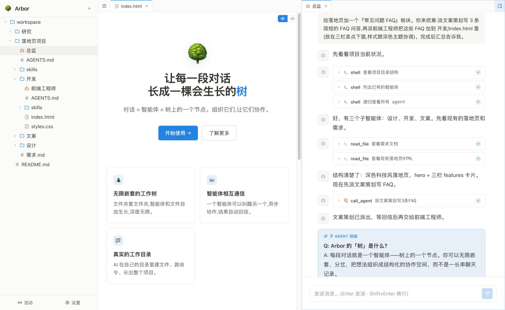

# Arbor 🌳

> 对话 = 一个 agent = 树上的一个节点。



我认为这个项目主要有这几个亮点:

## 一、对话即 agent,彼此通讯

目前,我们在 ChatGPT、Claude 上的历史对话大多都是沉寂的,但其实每个对话历史就是一个已经有上下文的 AI 智能体,本项目让它们之间彼此感知,相互通讯。

## 二、异步调用

实现也很简单:`call` 工具往另一个 agent 的消息记录里 push 一条消息,然后立即返回——不等它跑完,所以不会阻塞你自己这边的对话。对方在后台执行,跑完后,系统把它的结果作为一条新消息投回调用方的消息里,并自动唤醒调用方接着处理。所以整个调用是异步的。

## 三、树形组织

再然后,我们用树形结构把这些智能体组织起来,这样你可以有组织地、有层级地放置这些智能体,每个智能体都可以感受到自己的环境信息、指导文件、技能。

---

下面再多说一点。

## 每个 agent,有一块真实的工作目录

agent 所在的文件夹,就是它的工作目录,它的 `shell`、读写文件都在这里执行。你让它「做个网页放这」,它会真的 `write_file`、跑命令,在目录里长出 `index.html`——这个文件随即出现在左侧的树里,可点开、可编辑、可预览。AI 产出的是真实文件,而不是对话框里的一段代码。

## 它如何存储:文件系统即真相

结构不在数据库里,而在文件系统里(`workspaces/` 这个由 app 自管的根目录,它自行生长,你不导入既有目录):

```
workspaces/
  研究/                       ← 文件夹 = 真实目录
    a1b2….agent.json          ← 智能体 = 一份元数据(人格 / 已读位置 / 创建时间)
    notes.md                  ← 文件 = 真实文件
    src/  app.js              ← AI 用 shell 建的嵌套结构,本就是树的一部分
    子文件夹/                 ← 嵌套 = 子目录,可无限深
```

一句 `ls` 就能看清整棵树。SQLite 只承载运行时状态,不存结构:

| 表 | 内容 |
|---|---|
| `messages` | 每个智能体的消息流(`agent_id` = 智能体的 uuid) |
| `calls` | 智能体之间的调用关系 + 状态机(`pending / running / done / error / cancelled`) |
| `settings` | 模型 / key / 默认 system prompt |

**id 规则**:文件夹与文件用路径(改名、移动即变,前端重新拉取,无需 fs↔DB 同步);智能体用 uuid(稳定,`call_agent` 凭它寻址)。

## agent 手里的工具(11 个)

| 工具 | 用途 |
|---|---|
| `shell` | 在工作目录里执行**任意**命令——全功能,建目录、跑构建都在此 |
| `run_process` | 启动后台进程 / dev server / watch,不阻塞;日志与预览 URL 进入进程面板 |
| `list_processes` · `read_process_output` · `stop_process` | 查看 / 读取 / 停止后台进程 |
| `read_file` · `edit_file` · `write_file` | 带行号读 / 精确替换 / 整体重写(改文件首选这三个,比 shell sed 稳且省 token) |
| `web_fetch` | 抓取一个网页链接的正文,返回可读文本 |
| `create_agent` | 在当前文件夹下派生一个兄弟智能体,可附初始消息(异步) |
| `call_agent` | 向已存在的智能体发消息(异步,结果回到自己的消息流) |

> ⚠️ `shell` 在**你本机**执行任意命令、**无沙箱**——这是本地 agent 工具的常态。只在你信任的机器、对你信任的模型使用。

## 用起来什么感觉

前端是一套 VSCode 式的本地 GUI,常用的都顺手:

- **流式输出**,逐字实时呈现,带光标;支持任意 OpenAI 兼容接口(OpenAI / DeepSeek / Kimi / Gemini…)
- **多标签 + 左右分屏**;代码按扩展名高亮(CodeMirror);Markdown / HTML / 图片 / PDF 直接在标签内预览
- **⌘P 快速打开 · ⌘⇧F 全局搜索 · ⌘⇧P 命令面板**
- agent 运行时亮起**蓝点**、有未读则亮**绿点**,一眼看出谁在忙
- 让某个 agent 起 dev server,`run_process` 会自动识别**预览 URL**,旁边开个面板即可看效果
- 内置**终端**(可在某个 agent 的目录里直接拉起 codex / claude code)与一个 **Git 面板**
- 拖拽基于 dnd-kit 三 sensor(鼠标 / 触摸 / 键盘),**桌面与手机共用一套代码**

## 跑起来

```bash
git clone https://github.com/realuckyang/Arbor
cd Arbor
npm install

# 开发(两个进程)
npm run dev          # 后端,tsx watch,端口 9506
npm run gui          # 前端,vite dev,端口 5174(代理到 9506)

# 生产(构建 GUI,单端口运行)
npm run build        # vite build → gui/dist
npm start            # 后端 + GUI 同端口 http://localhost:9506
```

开发模式打开 **http://localhost:5174/**:

1. 左下角 ⚙ Settings → 填 API URL / API Key / Model(任何 OpenAI 兼容接口)
2. 左侧 `＋` → 新建一个智能体
3. 发条消息试试——让它「做个网页放这」,看它在自己的工作目录里长出文件,直接出现在树里

## 技术栈

Node 22+ · TypeScript · `node:sqlite`(内置,零外部数据库依赖)· React 19 · Tailwind 4 · Vite · CodeMirror 6 · @dnd-kit · ws

## 想读代码——架构

分层清晰:**api(HTTP)→ service(业务)→ repo(数据)**,另有 `agent/`(无状态 LLM 执行器)。

```
server/
├── agent/        🧠 无状态 LLM 执行器(不依赖任何 server 状态)——chat() 循环 / 工具 schema 与实现 / 多 provider 流式
├── service/      🎬 业务层——tree.ts(树操作 + 事件)/ agent.ts(拼 prompt、注入工作目录、回信、唤醒调用方)
├── repo/         💾 纯数据访问——tree.ts(文件系统即树)/ messages / calls / settings / search
├── api/          🌐 HTTP(很薄,只解析请求、拼响应,业务交给 service)
└── realtime.ts   📡 WebSocket(send / stop / 广播)
gui/src/components/   React 前端,按 UI 区域分模块:explorer(树)/ workspace(编辑器外壳 + panels)/ command / chat / files / settings / ui
```

`agent/` 不知道树是什么,只接收组装好的消息和 `ctx`(含工作目录 cwd)运行 LLM 循环;状态全在 `service` / `repo`。一万行出头,可以完整读完。

## 几句实话

- `shell` 全功能、**无沙箱**,只在你信任的机器、对你信任的模型使用。
- 提示词与注释**均为中文**,不习惯的话需要适应。
- 它是实验性的,不面向生产。

## License

MIT
